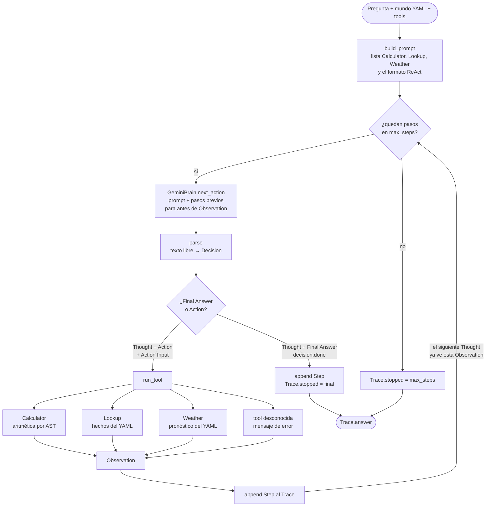

# Diagrama del agente ReAct

El agente es un ciclo **Thought → Action → Observation** hasta un **Final Answer** o hasta `max_steps`. Gemini solo escribe el razonamiento y la acción; el entorno ejecuta la tool y devuelve la observación.

Piezas que corresponden al código:

- **`run_react`** en `react/loop.py` arma el prompt, pide un turno, parsea y decide si parar o llamar una tool.
- **`GeminiBrain`** en `react/brain.py` genera un solo turno y se detiene en `Observation:`, para no inventar el resultado.
- **`parse`** en `react/parse.py` acepta `Thought + Final Answer` o `Thought + Action + Action Input`. Si aparecen ambos, gana Final Answer salvo que el Thought ya traiga un `Action:`.
- **`run_tool`** en `react/tools.py` no usa APIs reales: Calculator evalúa la expresión, Lookup y Weather leen `data/viaje.yaml`.
